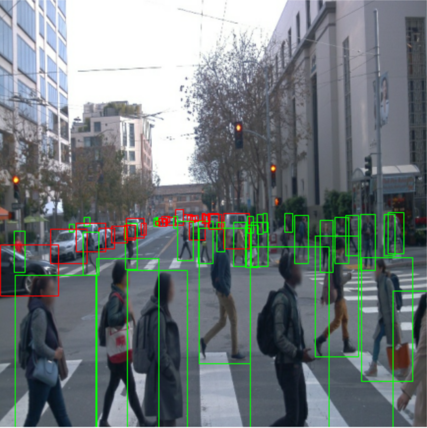
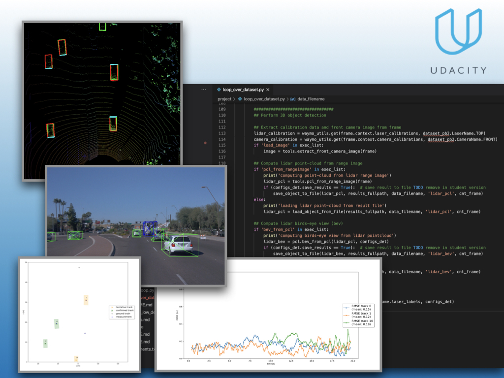

# Udacity Self Driving Car Engineer Nanodegree

## Object Detection in an Urban Environment

Convolutional neural network to detect and classify objects using data from [Waymo](https://waymo.com/).

## Sensor Fusion and Object Tracking
Use the Waymo dataset, along with sensor fusion, to track multiple 3D objects in the surrounding environment.

## Control and Trajectory Tracking for Autonomous Vehicles
A PID Controller to perform vehicle trajectory traking. Testing efficiency on the CARLA simulator.

https://user-images.githubusercontent.com/98892946/163715951-1d50c665-e1ff-4179-b214-ab4208be10f9.mov